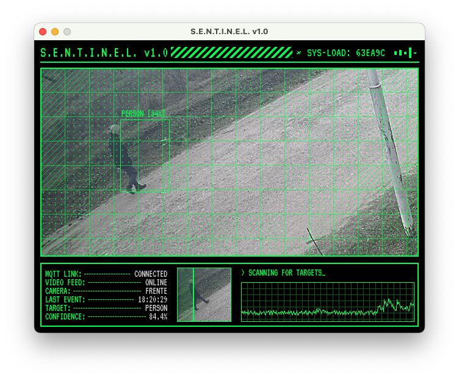
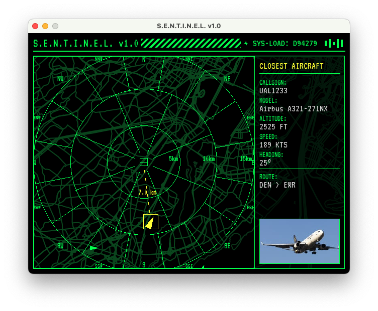

# Sentinel CRT





Sentinel CRT is a Python-based monitoring interface designed with a retro, CRT-like aesthetic. It's built to run on a Raspberry Pi connected to a CRT television, providing a heads-up display for real-time events from a [Frigate NVR](https://frigate.video/) instance and nearby air traffic.

## Features

-   **Frigate Integration**: Displays a live RTSP feed from a camera and overlays bounding boxes for detected objects from Frigate's MQTT events.
-   **Dynamic Zoom**: Automatically zooms in on objects of interest (e.g., people, cars) based on their location in defined zones.
-   **Alert Levels**: The interface color theme changes dynamically (Green, Orange, Red) based on the threat level of the zone an object enters.
-   **Aircraft Radar**: Switches to a radar map display when an aircraft is detected overhead, showing its position, callsign, altitude, and route.
-   **CRT Aesthetic**: Uses a retro pixel font (VT323) and visual effects like scanlines and grid overlays to mimic the look of an old terminal.
-   **Highly Configurable**: All settings, from MQTT credentials to alert zones and Mapbox tokens, are managed in a single `config.py` file.

## Hardware Requirements

-   **Raspberry Pi**: A raspberry Pi 3B+ or newer is recommended.
-   **CRT Television/Monitor**: Any CRT with a composite or RF input will work.
-   **HDMI to Composite/RF Adapter**: To connect the Raspberry Pi to the CRT.
-   A running instance of Frigate NVR on your network.
-   (Optional) An ADS-B flight tracking setup that publishes data to your MQTT broker.

## Software Requirements

-   Python 3
-   Pygame
-   OpenCV for Python
-   Paho-MQTT
-   Requests
-   Numpy

## Installation

### 1. Clone the Repository

```bash
git clone https://github.com/e2equiel/sentinel-crt.git
cd sentinel-crt
```

### 2. Install Dependencies

It's recommended to use a Python virtual environment.

```bash
python3 -m venv venv
source venv/bin/activate
pip install -r requirements.txt
```

### 3. Create Configuration File

Copy the example configuration file and edit it with your own settings.
```bash
cp config.py.example config.py
nano config.py
```
You will need to fill in:
-   Your MQTT broker details (`mqtt_host`, `mqtt_user`, `mqtt_password`).
-   Your camera's RTSP URL and Frigate settings (`camera_name`, `camera_rtsp_url`, etc.).
-   Your Frigate alert zones.
-   Your Mapbox account details (`mapbox_user`, `mapbox_token`, etc.) if you want to use the flight radar.
-   Your home latitude and longitude.

### 4. Download the Font

The application uses the `VT323` font. Download `VT323-Regular.ttf` from [Google Fonts](https://fonts.google.com/specimen/VT323) and place it in the same directory as `sentinel_crt.py`.

## Running on a Raspberry Pi

### 1. Prepare Raspberry OS

-   Install the latest Raspberry Pi OS Lite (64-bit).
-   Enable Composite Video Output: Edit the `/boot/config.txt` file by running `sudo nano /boot/config.txt`. Add the following lines:

    ```
    # Enable composite video
    enable_tvout=1
    # Set the video mode for CRT & generated a profile for RTC2 (e.g., 640x480 NTSC)
    sdtv_mode=0
    sdtv_aspect=1
    ```
    (Note: `sdtv_mode` can be 0 for NTSC or 2 for PAL. `sdtv_aspect` can be 1 for 4:3).
-   Reboot the Pi.

### 2. Install System Dependencies

You may need to install some system libraries for OpenCV and Pygame to work correctly.
```bash
sudo apt update && sudo apt upgrade
sudo apt install -y libopencv-dev libatlas-base-dev libavformat-dev libavcodec-dev libswscale-dev libqtgui4 libqt4-test
```

### 3. Follow Installation Steps

Follow steps 1-4 from the main **Installation** section above to clone the repository, install Python packages, configure the app, and download the font.

### 4. Run the Application

From within the `sentinel-crt` directory:

```bash
python3 sentinel_crt.py
```

### 5. (Optional) Run on Boot

To make the script run automatically when the Raspberry Pi starts, you can create a simple `systemd` service.

1.  Create a service file:
    ```bash
    sudo nano /etc/systemd/system/sentinel-crt.service
    ```
2.  Paste the following content, making sure to replace `/home/pi/sentinel-crt` with the actual path to the project directory.
    ```ini
    [Unit]
    Description=Sentinel CRT Service
    After=network.target

    [Service]
    ExecStart=/home/pi/sentinel-crt/venv/bin/python /home/pi/sentinel-crt/sentinel_crt.py
    WorkingDirectory=/home/pi/sentinel-crt
    StandardOutput=inherit
    StandardError=inherit
    Restart=always
    User=pi

    [Install]
    WantedBy=multi-user.target
    ```
3.  Enable and start the service:
    ```bash
    sudo systemctl daemon-reload
    sudo systemctl enable sentinel-crt.service
    sudo systemctl start sentinel-crt.service
    ```
You can check its status with `sudo systemctl status sentinel-crt.service`.